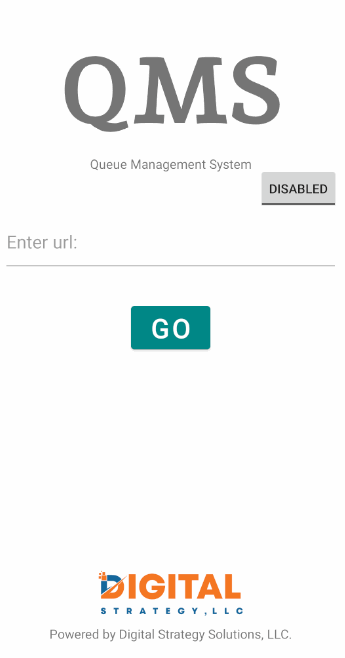

# LockedBrowser - Kiosk
LockedBrowser is an app that locks the browser and prevents the user from typing in a new URL. It functions like a kiosk.
## Features
- Login screen asks for url.
- Enable and disable button to prevent the login url from being edited.
- Web browser is locked and the URL is not available for typing.
- Back button brings user to previous page instead of exiting app.
## Features available but not visible.
- Login screen also asks for passcode
- Logout button above web browser brings the user to the login screen.
## App Walkthrough Gif
Here's a walkthrough of implemented features:

GIF created with [LiceCap](http://www.cockos.com/licecap/).
